# Practica 02 - Desarollo de una Aplicación Web con JPA y DAO.

Práctica de Plataformas Web en donde se aplican conocimientos de programación hipermedial aplicado al desarrollo de aplicaciones web usando distintos patrones de diseño.

**PRÁCTICA DE LABORATORIO**

**CARRERA** : Computación

**ASIGNATURA** : Plataformas Web

**TÍTULO PRÁCTICA** : Desarrollo de una aplicación JEE basado en Servlets, JSP y JPA para el intercambio de datos en un modelo de tres capas aplicando los patrones diseño de software MVC y DAO

**OBJETIVOS ALCANZADOS** :

> - Diseñar y desarrollar modelos de software en diferentes niveles de abstracción y modelos de datos a nivel transaccional y analítico con entornos de desarrollo actuales.

**ACTIVIDADES DESARROLLADAS**

<h3><strong>1. Considerar los requerimientos del sistema para el desarrollo del mismo. </strong></h3>

**Objetivo del sistema:** Permitir que un usuario registre requerimientos de compra, además de ver el estado de la misma, habiendo previamente iniciado sesión en el sistema.

**Reglas de negocio:**

> - Un usuario puede pertenecer a una sola empresa.
> - Una empresa cuenta con varios productos, los cuales están organizados por categorías.
> - Un producto puede pertenecer solo a una categoría.

**Requerimientos funcionales:**

1)	**[RF-1]** La aplicación deberá manejar dos roles: “Usuario” y “Administrador”.

2)	**[RF-2]** Un “Usuario” y “Administrador” pueden iniciar sesión usando su correo y contraseña.

3)	Una vez iniciado sesión el “Usuario” podrá:
> - **[RF-3]** Registrar, modificar, eliminar, buscar y listar sus requerimientos de compra.

4)	Una vez iniciado sesión el “Administrador” podrá:

> - **[RF-4]** Registrar, modificar, eliminar, buscar y listar los productos de su empresa.
> - **[RF-5]** Listar todos los requerimientos de compra de los “Usuarios” de su empresa.
> - **[RF-6]** Aprobar o rechazar los requerimientos de compra de los “Usuarios” de su empresa.

**Requerimientos no funcionales:**

1)	**[RNF-SEG-1]** El sistema deberá manejar sesiones y filtros.

2)	**[RNF-SEG-2]** El sistema deberá manejar una parte pública (index.html) y otra privada (RF).

3)	**[RNF-DIS-1]** El sistema debe aplicar los patrones de diseño MVC y DAO.

> - **Modelo:** Entidades de Java.
> - **Vista:** JSP + JSTL.
> - **Controlador:** Servlets y DAOs.

4) **[RNF-BD-1]** La persistencia de datos deberá ser a través de JPA, y aplicando Criteria y JPQL.

5)	**[RNF-USA-1]** El sistema, en su parte pública presentará un catálogo de productos filtrados por empresa.

6)	**[RNF-USA-2]** Las páginas del sistema deben contar con una experiencia e interfaz de usuario apropiada.

**Nota:** Los productos serán filtrados por la empresa a la cual pertenecen.

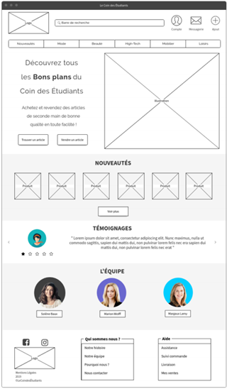

<h3><strong>2. Desarrollar una aplicación con tecnología JEE para gestionar requerimientos de compra en la web. </strong></h3>

**Herramientas utilizadas:**
> - **IDE:** Eclipse
> - **JDK:** v11.09
> - **SGBD:** MariaDB
> - **SVR de aplicaciones:** Tomcat

El desarrollo de la aplicación web se ha realizado siguiendo las recomendaciones y requerimientos planteados. Para tener una mejor organización se ha divido el modelo y controlador en 7 paquetes de acuerdo a su contenido.

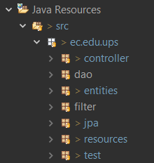

Así mismo, para la parte de la vista se ha organizado por carpetas dependiendo del tipo de archivo. Además, cabe resaltar que se han divido las páginas JSP en dos: la parte pública y la privada.

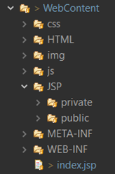

Tal como se planteó en los requerimientos, la parte pública es una página que muestra una vista general del sistema, en la cual, se presentan los catálogos de productos por empresa. Para ello se ha utilizado Bootstrap, para brindar una mejor experiencia de usuario, tal como se planteó como ejemplo.

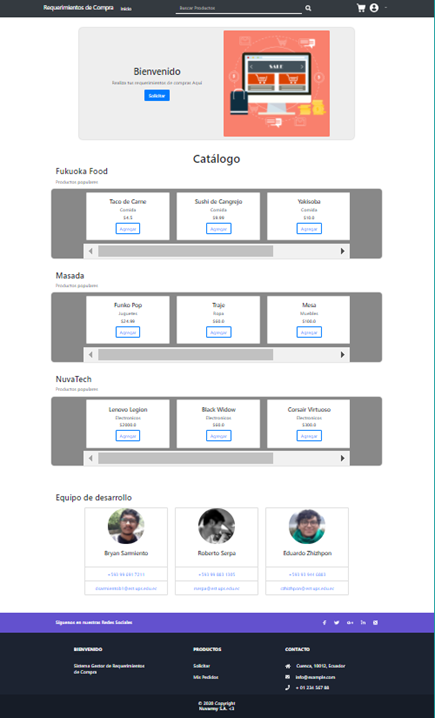

Para ingresar a las funcionalidades del sistema, se deberá ingresar mediante un inicio de sesión.  El mismo estará asegurado mediante el uso de sesiones y filtros de manera interna.

**Parte de la Vista:**

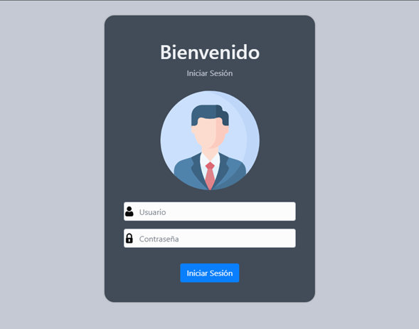

**Parte del Controlador:**

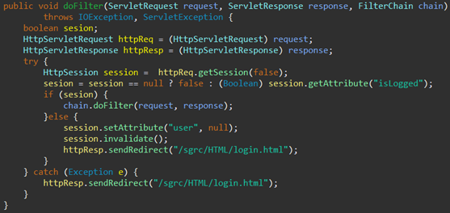

Para los requerimientos de un “Usuario”, se solicitaba que pueda realizar un CRUD, además de listar sus requerimientos de compra.

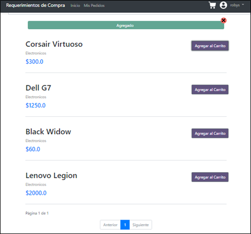

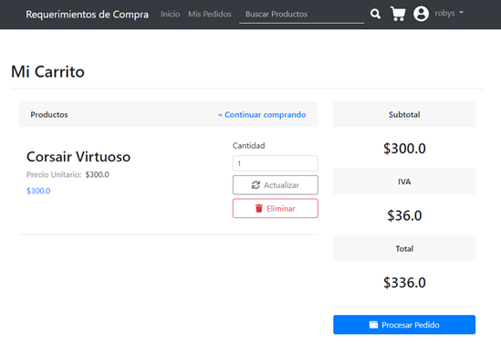

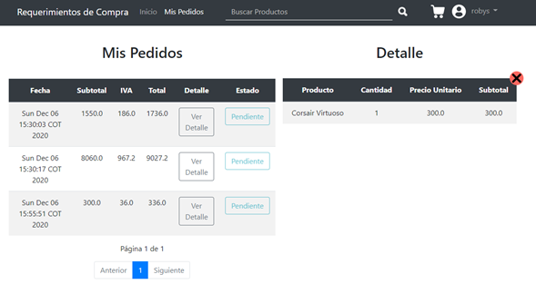

Para la parte de los requerimientos del “Administrador”, se solicitaba que este pudiera realizar un CRUD, y una lista de todos los productos de su empresa. Además, se el podrá listar todos los requerimientos de compra que se hayan realizado, y podrá aprobarlos o rechazarlos.

**Vista de la Gestión de Productos:**

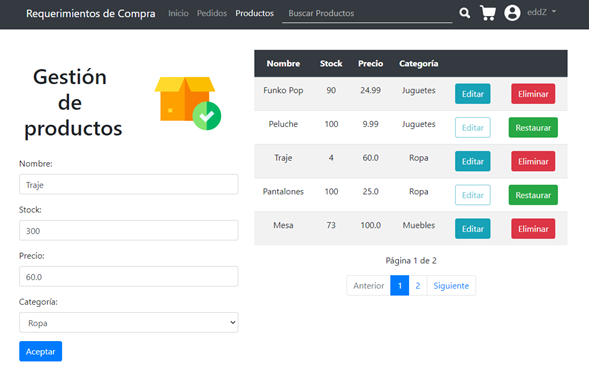

**Vista de los Requerimientos de Compra:**

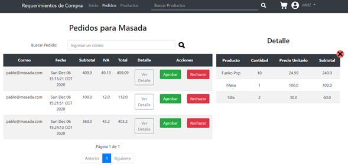

Para la parte de la persistencia de datos, se ha solicitado que se realice mediante el uso del patrón DAO, en conjunto con JPA (Java Persistence API). Esta API ha sido desarrollada para Java EE, permite manejar la persistencia de datos dentro de una aplicación sin perder el contexto y las funcionalidades de la programación orientada a objetos. 

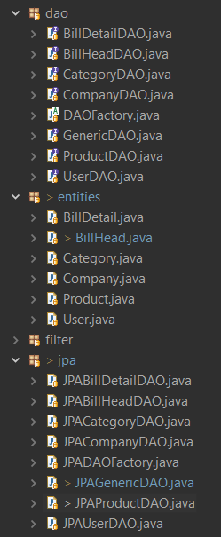

Para ello, se crearon métodos CRUD para cada entidad abstraída de los requerimientos, en donde se persiste y se abstrae la información en base a consultas JPQL.

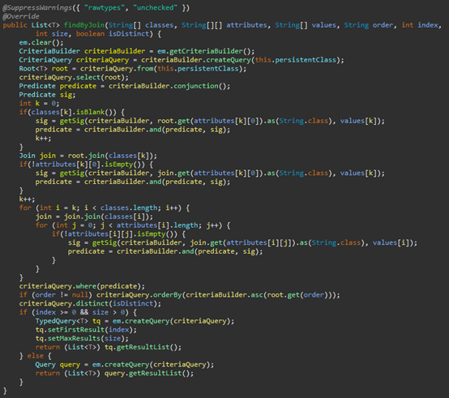

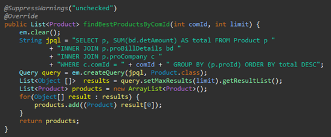

**RESULTADO(S) OBTENIDO(S)**:

> - Se logró manejar diferentes formatos para el intercambio de datos entre aplicaciones.
> - Se logró implementar un sistema web aplicando diferentes tipos de patrones de diseño orientados a negocios.
> - Se logró comprender ciertos aspectos acerca de la importancia del uso de patrones de diseño para la persistencia de datos.
> - Se logró entender las ventajas del uso de JPA.

**CONCLUSIONES** :

> - El uso de páginas JSP, junto con la librería JSTL permite al sistema tener una mayor flexibilidad ya que puede manipular las consultas SQL, realizar iteraciones, aplicar condiciones, entre otros.
> - El uso del patrón DAO, para la persistencia de datos permite que se separe la lógica de negocio con la parte de la lógica de acceso a los datos. Además, permite que el sistema obtenga datos desde varias fuentes sin gran dificultad.
> - La API JPA brinda diversas ventajas en el desarrollo de la programación en Java, esto debido a que mantiene el contexto de la funcionalidad de la POO, simplificando así la lógica de acceso a datos.

**RECOMENDACIONES** :

> - Aplicar buenas prácticas de programación y diseño.
> - Aplicar conceptos de HCI para el desarrollo de la GUI.
> - Haber asistido a las sesiones de clase.
> - Realizar las preguntas respectivas al docente encargado.
> - Revisar el contenido teórico del tema, además de bibliografía pertinente.

**Estudiantes:** 

- Sarmiento Douglas Bryan Sarmiento.
- Serpa Pulgarin Roberto Carlos
- Zhizhpon Tacuri Cesar Eduardo 